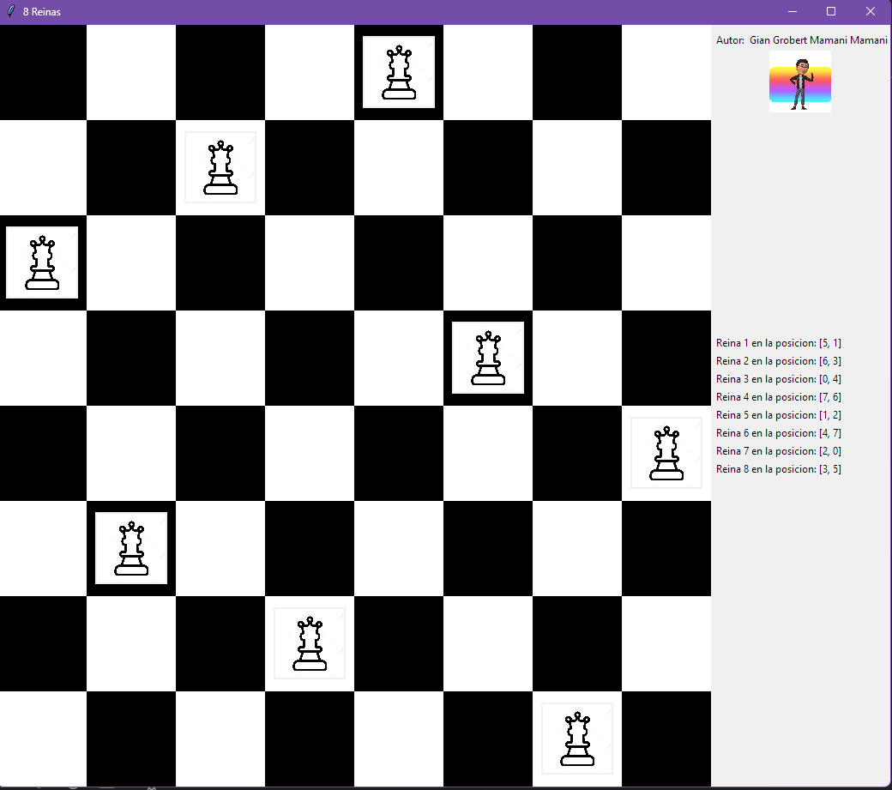

# Problema de las 8 Reinas
El problema de las ocho reinas es un pasatiempo que consiste en poner ocho reinas en el tablero de ajedrez sin que se amenacen. Fue propuesto por el ajedrecista alemán Max Bezzel en 1848.​ En el juego del ajedrez la reina amenaza a aquellas piezas que se encuentren en su misma fila, columna o diagonal. El juego de las 8 reinas consiste en poner sobre un tablero de ajedrez ocho reinas sin que estas se amenacen entre ellas. Para resolver este problema se puede emplear un esquema vuelta atrás (o Backtracking).

